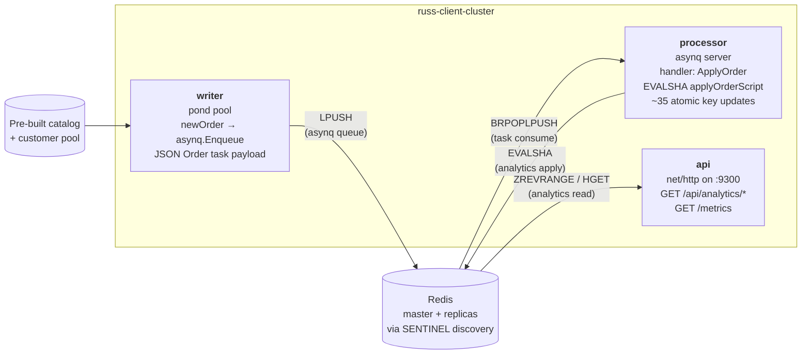

# russ — Redis Upgrade Sentinel Simulator

`russ` manages Redis and Redis Sentinel containers via Docker to simulate and validate the upgrade path from Redis 6.x to 8.x under sentinel-managed replication. It can also run a synthetic asynq-based e-commerce orders analytics workload against the cluster during the upgrade — a writer enqueues fake orders, a processor applies them atomically through a Lua script that maintains running summaries in Redis (counters, ZSETs, HyperLogLog, leaderboards, market-basket pairs), and a REST API + Prometheus surface exposes the analytics. The workload drives sustained traffic through sentinel failovers and replication catch-ups so the upgrade lifecycle runs against realistic load.

## Prerequisites

- Docker (running locally)
- Go 1.25+

## Build

```
make build
```

The `russ` binary is written to the repo root.

---

## Quickstart

For a one-command demo environment:

```
russ quickstart
```

Destroys any existing russ-managed containers (no prompt) and brings up a fresh stack in seven steps:

1. Observability (Prometheus + shared redis-exporter + Grafana with a preloaded redis dashboard)
2. 3 v6 sentinels
3. A 3-instance v6 cluster named `quickstart-1`
4. The russ-client image (built if not cached)
5. A workload container running the orders-analytics writer + processor + api against the v6-only cluster, with the writer's wave capped low (`--min-clients 1 --max-clients 4 --wave-period 5m`) so order ingest stays modest while v8 replicas are still being added
6. 3 v8 instances added to the (already-loaded) cluster

The workload starts before v8 instances join so the v8 replicas catch up against a master that's already taking writes — closer to the production scenario when staging an upgrade. Quickstart caps the writer wave at 4 enqueuers so the writes-during-sync window stays well under the master's per-replica output-buffer cap during the v8-add step. Even with `repl-diskless-sync=yes`, the master still queues writes-during-transfer in each syncing replica's output buffer — at higher writer concurrency those writes overflow the buffer mid-sync, kicking the replica and triggering a cascade of BGSAVE forks that OOM the v6 master. A 4-enqueuer cap keeps the rate low enough that a v8 replica can complete its full sync before the buffer fills.

The simulator's purpose at quickstart is to walk through the upgrade lifecycle end-to-end. To drive heavier traffic for stress testing, stop and restart the client with a higher `--max-clients` (e.g. `russ client workload stop quickstart-1 && russ client workload start quickstart-1 --min-clients 10 --max-clients 50`) *after* quickstart completes, against the already-stable mixed-version cluster.

The cluster ends up at lifecycle state `MixedVersions` with the v8 instances deprioritized (replica-priority 200, vs the v6 default of 100). Any sentinel failover triggered from this state will stay within the v6 subset and v6→v8 replication will remain intact — useful for rehearsing failovers before committing to the upgrade. The trailing hint points at `russ cluster promote-v8 quickstart-1` as the next step; that command swaps the priorities, advances the FSM to `V8Prioritized`, and unlocks the actual v8 promotion via `russ cluster failover quickstart-1`.

| Flag | Default | Notes |
|---|---|---|
| `--cluster-name` | `quickstart-1` | Cluster name to create |
| `--v8-count` | `3` | Number of v8 instances to add after creation |

---

## Quickstart Video

[](https://asciinema.org/a/1cLLeDjeeA1IHAJV)

## Upgrade path overview


Each step below maps to one or more `russ` commands. `russ cluster status <cluster>` shows the current lifecycle state and the next valid trigger; `russ cluster lifecycle <cluster>` renders the full FSM as a tree with the current position marked (example below).

The `MixedVersions → V8Prioritized` edge is deliberately explicit. New v8 instances enter the cluster with a *deprioritized* `replica-priority` (200, vs the default 100 on v6), so a sentinel failover triggered from `MixedVersions` stays within the v6 subset and replication to the v8 nodes stays intact. The operator runs `russ cluster promote-v8` once they're ready to commit to the upgrade; that command swaps the priorities (v8=1, v6=100) and advances the FSM. The subsequent `Failover` then picks a v8 candidate.

The FSM deliberately has no `AllV6 → FailoverComplete` shortcut. A failover is allowed in any state (see [Operational failovers](#operational-failovers)), but the lifecycle only *advances* on a failover when the cluster is in `V8Prioritized`, so a no-v8 cluster (or a still-deprioritized mixed cluster) can't accidentally walk into `V6Destroyed`.

### Visualizing position in the FSM

```
$ russ cluster lifecycle quickstart-1
Cluster:  quickstart-1
State:    FailoverComplete

  ✓  AllV6
  │    AddV8Instance         russ instance add <cluster> --version=8
  ✓  MixedVersions
  │    PromoteV8             russ cluster promote-v8 <cluster>
  ✓  V8Prioritized
  │    Failover              russ cluster failover <cluster>
  ▶  FailoverComplete   (current)
  │    BreakReplication      russ cluster isolate-v6-replicas <cluster>   ⇐ next
  ○  ReplicationBroken
  │    DestroyV6             russ instance rm <last v6 instance>   (auto-advances)
  ○  V6Destroyed
  │    AddV8Sentinels        russ sentinel add --version=8
  ○  V8SentinelsAdded
  │    RemoveV6Sentinels     russ sentinel rm <last v6 sentinel>   (auto-advances)
  ○  Done
```

Markers: `✓` complete, `▶` current, `○` pending. The `⇐ next` arrow points at the trigger that will advance the current state. The topology is introspected from the actual state machine in `internal/state/machine.go`, so the tree stays in sync if the FSM is ever extended.

### Next-step hints after every state-advancing command

Every command that can advance the FSM (`cluster create`, `instance add`, `instance rm`, `cluster failover`, `cluster promote-v8`, `cluster isolate-v6-replicas`, `sentinel add`, `sentinel rm`) ends its output with a `Next upgrade step: russ ...` line, driven by the same FSM-walk as `cluster lifecycle`. If a command runs from a state where it can't advance the lifecycle (e.g. `cluster failover` from `AllV6`), the operation still happens — the hint just reflects the unchanged state.

---

## Step-by-step walkthrough

### 0. Add the initial v6 sentinel fleet

```
russ sentinel add --version=6 --count=3
```

Builds the tilt-patched sentinel image (compiled from Redis source, tag `russ-sentinel:6`) if it doesn't already exist, then starts an odd number of sentinel containers. Three is the minimum for a meaningful quorum.

The same command is used later to add v8 sentinels to the running fleet (see step 8); `bootstrap` is accepted as an alias for backwards compatibility.

Useful flags:

| Flag | Default | Notes |
|---|---|---|
| `--version` | `6` | `6` or `8`. Adding v8 sentinels also reconciles existing clusters in `V6Destroyed`. |
| `--count` | `3` | Odd numbers recommended. |
| `--port-range` | `26379-26450` | First-fit allocation. |
| `--redis-source-version` | `6.2.17` (v6) / `8.0.0` (v8) | Exact tag compiled into the sentinel image. |
| `--force-rebuild` | `false` | Force rebuild of the sentinel image. |

Confirm:

```
russ sentinel ls
```

---

### 1. Create a v6 cluster

```
russ cluster create mycluster --version=6 --count=3
```

Starts one master and `--count - 1` replicas, configures replication, and registers the cluster with every running sentinel via `SENTINEL MONITOR`. State file `~/.russ/state/mycluster.json` is created at `AllV6`.

Useful flags:

| Flag | Default | Notes |
|---|---|---|
| `--version` | `6` | `6` or `8`. |
| `--count` | `3` | Total instance count (1 master + N−1 replicas). |
| `--port-range` | `6380-6500` | First-fit allocation. |
| `--max-memory` | `256mb` | Redis `maxmemory` applied to every instance. The container's hard memory cap auto-scales to `max(1 GiB, 8 × maxmemory)` to absorb AOF rewrite COW, replica output buffers, and post-failover catch-up bursts. See [Container memory limits](#container-memory-limits) for the full table. |
| `--max-memory-policy` | `volatile-lru` | Redis eviction policy when `maxmemory` is hit. `volatile-lru` only evicts keys with a TTL — pairs naturally with the orders-analytics workload's per-hour bucket keys (which carry a 72h TTL). Other valid values: `allkeys-lru`, `allkeys-lfu`, `volatile-lfu`, `volatile-ttl`, `volatile-random`, `allkeys-random`, `noeviction`. |
| `--enable-disk-persistence` | `true` | AOF + RDB persistence on; bind-mounts a per-instance Docker volume at `/data`. Pass `--enable-disk-persistence=false` to run dataset-in-RAM only (bounded by `--max-memory` + eviction, no volume). See [Redis persistence (AOF + RDB)](#redis-persistence-aof--rdb) for the trade-offs. |

Confirm:

```
russ cluster status mycluster
```

The output uses live state from each node (see [Reading the instance table](#reading-the-instance-table)). Expect one `master` and two `replica` rows, all showing `REPLICATING FROM` pointing at the master.

---

### 2. (Optional) Start the orders-analytics workload

If you want sustained load on the cluster during the upgrade — so failovers and replication catch-ups move real data — build the client image once and start a workload container for the cluster. See [Client (orders-analytics workload)](#client-orders-analytics-workload) for the full reference.

```
russ client build
russ client workload start mycluster
```

Tail logs:

```
docker logs -f russ-client-mycluster
```

Combined with `russ observability start` (see [Observability](#observability)), Prometheus auto-discovers the workload and you can watch the upgrade play out against PromQL queries. The JSON analytics API is published on `http://127.0.0.1:9300` — `russ client analytics --help` lists every endpoint as a navigable subcommand (see [Analytics REST API](#analytics-rest-api)).

---

### 3. Add a v8 replica

```
russ instance add mycluster --version=8
```

Starts a new instance, points it at the current sentinel-reported master via `REPLICAOF`, and waits until replication is fully synced. The command then issues `SENTINEL RESET` and polls `SENTINEL REPLICAS` until at least one sentinel has acknowledged the new replica — this closes the race where a failover triggered immediately afterward could otherwise strand the new node in a chained replication state.

While the cluster is in `AllV6` or `MixedVersions`, every new v8 instance enters with `--replica-priority 200` (the v6 default is `100`). Lower priority numbers are preferred for promotion in Redis, so any sentinel failover triggered from `MixedVersions` stays within the v6 subset and replication to the v8 nodes is preserved. The deprioritization is automatic — there's no flag to disable it; the explicit `russ cluster promote-v8` step (below) is the way to flip it.

Useful flags:

| Flag | Default | Notes |
|---|---|---|
| `--version` | `6` | `6` or `8`. Adding a v8 instance to an all-v6 cluster auto-advances the FSM to `MixedVersions`. |
| `--port-range` | `6380-6500` | First-fit allocation. |
| `--max-memory` | `256mb` | Redis `maxmemory` for the new instance. Should normally match what the rest of the cluster was created with. |
| `--max-memory-policy` | `volatile-lru` | Eviction policy for the new instance (see [step 1](#1-create-a-v6-cluster) for the full set). |
| `--enable-disk-persistence` | `true` | AOF + RDB on by default, matching the same default on `cluster create`. Pass `--enable-disk-persistence=false` if the existing cluster was created without persistence — russ doesn't currently auto-detect from existing instances, so the new instance must be told to match. |

Confirm:

```
russ cluster status mycluster
```

Expected state: `MixedVersions`. Four instances: three v6, one v8 replica. The v8 row should show `REPLICATING FROM <master>:<port> (up)`.

> Add more v8 replicas with repeated `instance add --version=8` calls if you want additional candidates before failover. All of them enter at priority 200 until `promote-v8` runs.

---

### 4. Promote v8 instances

```
russ cluster promote-v8 mycluster
```

Sets `replica-priority 1` on every v8 instance and `100` on every v6 instance, then waits until sentinel has actually observed the new values (CONFIG SET takes effect on the replica immediately, but sentinel only refreshes its priority cache on its periodic `INFO REPLICATION` poll — typically ~10s). After this step, the next failover will promote a v8 candidate.

This is the explicit "commit to the upgrade" step. Before it, the cluster sits in `MixedVersions` with v8 nodes deprioritized — useful for exercising sentinel quorum or rehearsing failovers without breaking v6→v8 replication. After it, the cluster is in `V8Prioritized` and the next sentinel failover will tip the master into the v8 subset.

The current master is identified live from sentinel (not from container labels) and skipped — Redis won't accept CONFIG SET replica-priority on the master, and the value is moot until the node becomes a replica again.

Expected state: `V8Prioritized`. `russ cluster status mycluster` still shows the same topology; only the priorities have changed.

---

### 5. Fail over to a v8 master

```
russ cluster failover mycluster
```

The command does two things in order:

1. **Pre-flight reconciliation.** Walks every Redis instance and re-issues `REPLICAOF` against the current sentinel-reported master on any node that isn't already a direct replica of it. Then waits for sentinel to see the rewired replica via its natural `INFO REPLICATION` poll cycle. This breaks chained replication so no v8 candidate is invisible to sentinel.
2. **`SENTINEL FAILOVER`.** Retries up to 6 times with 5s backoff if sentinel briefly returns `NOGOODSLAVE` (it can while still pinging freshly-discovered replicas). Then waits up to 60s for the master to switch to any non-master port — sentinel decides the winner from the `replica-priority` regime set up by `promote-v8`, so the lowest-priority v8 wins.

Failover is version-agnostic at this layer: the priority adjustment that biases the outcome is the `promote-v8` step above, and the FSM enforces ordering. From `V8Prioritized` the failover advances the lifecycle to `FailoverComplete`. From any other state the failover still runs (useful for rehearsals) but the lifecycle does not advance — see [Operational failovers](#operational-failovers).

Expected state: `FailoverComplete`. `russ cluster status mycluster` should show a v8 instance as `master` and the v6 instances as `replica` rows pointing at it (with `(down)` replication status, since Redis 6 can't replicate from Redis 8 — that's the cue for the next step).

---

### 6. Isolate v6 replicas

```
russ cluster isolate-v6-replicas mycluster
```

Issues `REPLICAOF NO ONE` on every v6 instance that is not the current master (after step 5, that's all of them) and then issues `SENTINEL RESET mycluster` so sentinels rediscover the topology.

Expected state: `ReplicationBroken`. In `russ cluster status mycluster` the v6 rows will now show role `isolated` with `REPLICATING FROM` set to `-` — they consider themselves masters but sentinel disagrees.

---

### 7. Remove v6 instances

```
russ instance ls mycluster        # find the v6 instance names
russ instance rm russ-mycluster-<port>
russ instance rm russ-mycluster-<port>
russ instance rm russ-mycluster-<port>
```

Each removal issues `REPLICAOF NO ONE`, resets all sentinels, then stops and removes the container. When the last v6 instance is removed the lifecycle advances automatically.

Expected state after the last removal: `V6Destroyed`. Only the v8 instances should remain.

---

### 8. Add v8 sentinels to the fleet

```
russ sentinel add --version=8 --count=3
```

Same command as step 0; with `--version=8` against clusters in `V6Destroyed` it triggers extra behavior:

1. **Pre-flight warning.** Lists any clusters not yet in `V6Destroyed` (those won't be registered with the new sentinels).
2. **Builds the v8 sentinel image** (`russ-sentinel:8`) if needed.
3. **Starts the new sentinels.**
4. **Registers `V6Destroyed` clusters** with each new sentinel by asking a still-running v6 sentinel for the current master, then issuing `SENTINEL MONITOR` on the new ones.
5. **Recalculates quorum** (`floor(N/2) + 1`) and pushes it to every sentinel.
6. **Advances the FSM** on every cluster currently in `V6Destroyed` to `V8SentinelsAdded`.

Confirm: `russ sentinel ls` shows six sentinels (three v6, three v8); state is `V8SentinelsAdded`.

---

### 9. Remove v6 sentinels

```
russ sentinel ls
russ sentinel rm russ-sentinel-<port>
russ sentinel rm russ-sentinel-<port>
russ sentinel rm russ-sentinel-<port>
```

Each removal:

1. Issues `SENTINEL REMOVE` for every cluster the sentinel was monitoring.
2. Recalculates quorum across the remaining sentinels.

When the last v6 sentinel is removed, every cluster in `V8SentinelsAdded` advances to `Done`. Confirm with `russ cluster status mycluster`.

---

## Reading the instance table

Both `russ cluster status <cluster>` and `russ instance ls <cluster>` render the same table, derived from each node's *live* `INFO replication` (not from container labels):

```
NAME              ROLE       VER  PORT   REPLICATING FROM           STATUS
russ-mc-6380      replica    v6   6380   russ-mc-6384:6384 (up)     Up 5 minutes
russ-mc-6381      replica    v6   6381   russ-mc-6384:6384 (up)     Up 5 minutes
russ-mc-6382      isolated   v6   6382   -                          Up 5 minutes
russ-mc-6383      replica    v8   6383   russ-mc-6384:6384 (up)     Up 4 minutes
russ-mc-6384      master     v8   6384   -                          Up 4 minutes
russ-mc-6385      replica    v8   6385   russ-mc-6384:6384 (down)   Up 4 minutes
```

`ROLE` values:

| Value | Meaning |
|---|---|
| `master` | Node reports `role:master` and sentinel agrees this is the cluster leader. |
| `replica` | Node reports `role:slave`. |
| `isolated` | Node reports `role:master` but sentinel reports a *different* port as master — typically after `REPLICAOF NO ONE`, or stale after a failover. |
| `unreachable` | `INFO replication` failed against the node. |

`REPLICATING FROM` is `<master_host>:<master_port> (<master_link_status>)` for replicas, or `-` for masters / isolated nodes. A `(down)` status flags a broken replication link. A target that doesn't match the current leader flags chained replication.

---

## Client (orders-analytics workload)

`russ client workload` runs an asynq-backed e-commerce orders analytics engine inside one container per cluster. Three roles share a single Go process, coordinated via `errgroup`:

| Role | What it does |
|---|---|
| writer | Wave-scaled [pond](https://github.com/alitto/pond) pool generates fake orders (Customer + ShipTo Address + LineItems sourced from a fixed catalog with stable per-product prices) and enqueues `order:process` tasks on the asynq `orders_analytics` queue. Pool size oscillates between `--min-clients` and `--max-clients` over `--wave-period` so failovers always meet a non-trivial — but bounded — write rate. |
| processor | Asynq server consuming the `orders_analytics` queue. Each handler runs a single Lua script that atomically applies the entire order's analytics deltas (~35 keys: counters, ZSETs, HyperLogLog, hourly buckets, leaderboards, market-basket pairs, new/returning split) so concurrent orders can never leave aggregates partially updated. |
| api | `http.Server` on port 9300 (also published on host loopback) serving `/api/analytics/*` JSON endpoints + Prometheus `/metrics`. Every endpoint is also reachable via `russ client analytics …` — see [Analytics REST API](#analytics-rest-api). |

The analytics design is **durable aggregates only**. No individual orders, customers, or line items are stored — asynq is purely a work-distribution transport, and each task payload is consumed and discarded once the handler returns. What lives in Redis are the running summaries, indexed by ~35 keys under the `analytics:*` namespace.

### Architecture



Disable any of the three by passing `--no-writer`, `--no-processor`, or `--no-api` — useful for running just the API against an already-populated cluster, or splitting writer and processor across containers.

### Analytics REST API

The container publishes port 9300 to host loopback by default. Every endpoint is GET-only and returns JSON. There are two ways to query it:

```
# Direct HTTP (handy from outside the russ binary)
curl 'http://127.0.0.1:9300/api/analytics/top-products?by=revenue&limit=5' | jq

# CLI subcommand tree — mirrors the URL paths, defaults --addr to http://127.0.0.1:9300
russ client analytics top-products --by revenue --limit 5
russ client analytics top-orders by-total
russ client analytics summary
```

`russ client analytics --help` lists every leaf with its query-param flags. Pass `--cluster <name>` instead of `--addr` to discover the workload container's host-published port via Docker — useful when multiple clusters are running on non-default ports (e.g. `russ client analytics --cluster mycluster top-customers --by spend`).

| Path | CLI | Summary |
|---|---|---|
| `/api/analytics/summary` | `russ client analytics summary` | Top-level totals: orders, revenue/tax/shipping, line items, unique customers (HLL), AOV |
| `/api/analytics/top-products` | `russ client analytics top-products [--by units|revenue] [--limit N]` | Top-N products |
| `/api/analytics/top-categories` | `russ client analytics top-categories [--by units|revenue] [--limit N]` | Top-N categories |
| `/api/analytics/by-state` | `russ client analytics by-state [--by count|revenue] [--limit N]` | Orders + revenue per state |
| `/api/analytics/timeseries` | `russ client analytics timeseries [--hours N]` | Per-hour rolling timeseries (1–72h) |
| `/api/analytics/value-distribution` | `russ client analytics value-distribution` | Order-value histogram (fixed dollar buckets) |
| `/api/analytics/top-orders/by-total` | `russ client analytics top-orders by-total` | Top 10 most expensive orders |
| `/api/analytics/top-orders/by-line-items` | `russ client analytics top-orders by-line-items` | Top 10 orders by cart qty |
| `/api/analytics/top-orders/by-max-item` | `russ client analytics top-orders by-max-item` | Top 10 orders by single highest unit price |
| `/api/analytics/cart-size-distribution` | `russ client analytics cart-size-distribution` | Histogram of qty/order |
| `/api/analytics/hour-of-day` | `russ client analytics hour-of-day` | 24-bucket UTC heatmap |
| `/api/analytics/day-of-week` | `russ client analytics day-of-week` | 7-bucket UTC heatmap |
| `/api/analytics/top-customers` | `russ client analytics top-customers [--by spend|orders] [--limit N]` | Top-N customers |
| `/api/analytics/aov-by-state` | `russ client analytics aov-by-state [--limit N]` | States ranked by average order value |
| `/api/analytics/top-zips` | `russ client analytics top-zips [--by count|revenue] [--limit N]` | Top-N zip codes |
| `/api/analytics/revenue-concentration` | `russ client analytics revenue-concentration` | Pareto curve over the catalog |
| `/api/analytics/top-pairs` | `russ client analytics top-pairs [--limit N]` | Market-basket co-occurrence (top SKU pairs) |
| `/api/analytics/new-vs-returning` | `russ client analytics new-vs-returning` | Order/revenue split between first-seen and repeat customers |
| `/metrics` | — | Prometheus exposition |

### Build the client image

```
russ client build
```

Constructs a multi-stage build context from the local source tree (auto-detected by walking up from the cwd looking for `module github.com/bigcommerce/russ`) and builds `russ-client:latest`.

| Flag | Default | Notes |
|---|---|---|
| `--force-rebuild` | `false` | Rebuild even if `russ-client:latest` already exists. Reuses Docker's layer cache so offline rebuilds work when only source files changed. To truly bypass the cache, `docker image rm russ-client:latest` first. |
| `--project-root` | autodetect | Override the path to the russ source tree. |

### Run

```
russ client workload start mycluster
russ client workload stop [mycluster]   # stop one cluster's client, or all
russ client ls                           # list client containers
```

Writer flags (passed through to the in-container `russ-client run` subcommand):

| Flag | Default | Notes |
|---|---|---|
| `--min-clients` | `2` | Wave-trough enqueuer count |
| `--max-clients` | `50` | Wave-peak enqueuer count |
| `--wave-period` | `5m` | Full cosine cycle (trough → peak → trough) |
| `--min-client-ttl` | `2s` | Minimum per-enqueuer lifetime; each enqueuer self-terminates after a random duration in this range to keep connection churn realistic |
| `--max-client-ttl` | `30s` | Maximum per-enqueuer lifetime |
| `--tick` | `100ms` | Per-enqueuer interval between enqueues; `0` = unthrottled |
| `--burst` | `false` | Skip wave scaling; run flat at `--max-clients` immediately |
| `--customer-pool` | `5000` | Pre-generated customer pool size; smaller = higher repeat-customer rate (more interesting HLL drift, more new-vs-returning churn) |
| `--catalog-size` | `500` | Pre-generated product catalog size; smaller = stronger top-N concentration in the leaderboards |
| `--min-line-items` | `1` | Per-order minimum line-item count |
| `--max-line-items` | `5` | Per-order maximum line-item count |

Processor flags:

| Flag | Default | Notes |
|---|---|---|
| `--concurrency` | `100` | Asynq worker goroutines |

Subset toggles — useful for re-attaching to a running ingest, or running just the API:

| Flag | Default | Notes |
|---|---|---|
| `--no-writer` | `false` | Skip the writer goroutine inside the container |
| `--no-processor` | `false` | Skip the processor goroutine |
| `--no-api` | `false` | Skip the API goroutine |

Shared:

| Flag | Default | Notes |
|---|---|---|
| `--metrics-port` | `9300` | Container-internal port for `/metrics` + the JSON API |
| `--api-host-port` | `9300` | Host loopback port to publish the API on (`0` = no publish, container reachable only on the russ network) |
| `--log-level` | `info` | russ-client log level |

One container per cluster: `russ-client-<cluster>`. Spin up more for additional clusters in parallel.

### Metrics

The client binary embeds the Prometheus client and exposes `/metrics` on port 9300 inside the russ network (and on host loopback by default). Prometheus picks the container up automatically (it's labeled `russ.role=client-workload` + `russ.target.port=9300`).

**Writer**:

| Metric | Labels | Meaning |
|---|---|---|
| `russ_client_orders_enqueued_total` | — | `order:process` tasks successfully enqueued by the writer pool |
| `russ_client_orders_enqueue_errors_total` | `kind` | Enqueue failures (`context`/`network`/`other`) |
| `russ_client_writer_enqueuers_active` | — | Currently running enqueuer goroutines in the pond pool |
| `russ_client_writer_wave_target` | — | Current wave target (number of enqueuers the coordinator is driving toward) |
| `russ_client_writer_revenue_cents_enqueued_total` | — | Cumulative order total (cents) on the write side. Compared against the processor counter, divergence = backlog growth |

**Processor**:

| Metric | Labels | Meaning |
|---|---|---|
| `russ_client_orders_processed_total` | — | Orders fully applied by the processor (Lua script returned OK) |
| `russ_client_revenue_cents_processed_total` | — | Cumulative order total (cents) on the processor side |
| `russ_client_line_items_processed_total` | — | Cumulative line-item quantities applied (sum of qty across all processed orders) |
| `russ_client_processor_apply_duration_seconds` | — | Histogram: wall-clock time for `ApplyOrder` (the Lua script round-trip) |
| `russ_client_processor_errors_total` | `task, kind` | Asynq task failures by task type and error kind |

**API**:

| Metric | Labels | Meaning |
|---|---|---|
| `russ_client_api_requests_total` | `route, status` | HTTP requests served by the API, by route name and status class (`2xx`/`4xx`/`5xx`) |
| `russ_client_api_request_duration_seconds` | `route` | Histogram: HTTP request latency by route |

Plus the standard `process_*` and `go_*` collectors.

The `workload_cluster` label (set by Prometheus's relabel rules) lets you slice by cluster when multiple client containers are running in parallel.

### Health-check queries

```
# Aggregate order throughput (orders/sec) on each side of the queue
rate(russ_client_orders_enqueued_total[1m])
rate(russ_client_orders_processed_total[1m])

# Backlog: outstanding orders waiting in asynq
russ_client_orders_enqueued_total - russ_client_orders_processed_total
    # Steady-state should hover near zero. A sustained climb means the
    # processor is falling behind — bump --concurrency or scale --max-clients down.

# Revenue rate (USD/sec) on each side
rate(russ_client_writer_revenue_cents_enqueued_total[1m]) / 100
rate(russ_client_revenue_cents_processed_total[1m]) / 100

# Revenue backlog (USD)
(russ_client_writer_revenue_cents_enqueued_total - russ_client_revenue_cents_processed_total) / 100

# Apply-script latency percentiles (Lua round-trip)
histogram_quantile(0.50, sum by (le) (rate(russ_client_processor_apply_duration_seconds_bucket[1m])))
histogram_quantile(0.95, sum by (le) (rate(russ_client_processor_apply_duration_seconds_bucket[1m])))
histogram_quantile(0.99, sum by (le) (rate(russ_client_processor_apply_duration_seconds_bucket[1m])))

# Failover transition errors (brief spike expected during 'cluster failover')
sum by (kind) (rate(russ_client_orders_enqueue_errors_total[1m]))
sum by (task, kind) (rate(russ_client_processor_errors_total[1m]))
    # Should settle to zero a few seconds after the failover completes

# API request rate + p95 latency by route
sum by (route, status) (rate(russ_client_api_requests_total[1m]))
histogram_quantile(0.95, sum by (route, le) (rate(russ_client_api_request_duration_seconds_bucket[1m])))

# Processing efficiency over a 5-minute window
rate(russ_client_orders_processed_total[5m]) / clamp_min(rate(russ_client_orders_enqueued_total[5m]), 0.0001)
    # Steady-state ≈ 1.0; values < 1 indicate persistent backlog growth.
```

---

## Observability

`russ observability` spins up three containers: a Prometheus, **one shared** `redis_exporter` running in multi-target mode, and a Grafana pre-provisioned with the Prometheus data source and two bundled dashboards (see [Bundled Grafana dashboards](#bundled-grafana-dashboards) below). The exporter has no per-instance configuration — it exposes `/scrape?target=redis://...` and dials whatever URI Prometheus passes in. Prometheus discovers Redis containers via `docker_sd_config` and rewrites each scrape to flow through the shared exporter. Adding or removing Redis instances is auto-discovered within ~5 seconds; no exporter sidecars to manage, no Prometheus reload.

```
russ observability start [--port 9090] [--grafana-port 3000] [--retention 2h]
russ observability ls                                      # show what's running
russ observability stop                                    # tear down
```

| UI | Default URL | Override |
|---|---|---|
| Prometheus | `http://127.0.0.1:9090` | `--port` |
| Grafana | `http://127.0.0.1:3000` | `--grafana-port` |

Default retention is 2 hours; configurable via `--retention` (e.g. `30m`, `1d`). Grafana opens directly to a dashboards list — no login prompt — and the redis dashboard is in the General folder. The "instance" template dropdown shows targets as `redis://<container>:<port>`; switching it filters every panel to that instance.

### How the dynamic wiring works

The shared exporter is `russ-redis-exporter` on the russ network. It's started with no `REDIS_ADDR` so it stays in multi-target mode. Prometheus's `redis-instances` scrape job:

1. Uses `docker_sd_configs` against `unix:///var/run/docker.sock` (read-only bind mount) filtered to `russ.managed=true`.
2. Relabel-keeps only containers with `russ.role=master|replica` (skips sentinels, the exporter itself, workload containers).
3. Relabel-keeps only the russ-network entry per container, so multi-network containers don't emit duplicate targets.
4. Builds the target URI from the container's existing `russ.name` and `russ.port` labels: `redis://<name>:<port>`.
5. Stores that URI in `__param_target` and `instance`, then **overrides `__address__` to `russ-redis-exporter:9121`**.
6. Promotes `russ.name` / `russ.cluster` / `russ.version` to `redis_instance` / `redis_cluster` / `redis_version_major`.

Net effect: every scrape becomes `GET http://russ-redis-exporter:9121/scrape?target=redis://<container-name>:<port>`, the exporter dials that Redis on demand, and Prometheus stores the result with stable instance/cluster/version labels.

Container DNS on the russ bridge resolves all the `russ-...` names, so the exporter never needs to know the IP of anything.

### Useful queries

```
redis_up                                           # 1 if reachable, 0 otherwise
redis_connected_clients                            # clients per instance
redis_memory_used_bytes                            # heap usage
redis_db_keys                                      # key count per db
rate(redis_commands_processed_total[1m])           # ops/sec per instance
redis_master_link_up                               # replication link health
redis_master_repl_offset - redis_slave_repl_offset # replication lag
redis_up{redis_version_major="8"}                  # v8-only filter during upgrade
sum by (redis_cluster) (redis_db_keys)             # total keys per cluster
```

The exporter (`oliver006/redis_exporter`) publishes ~70 redis-specific metrics — see [its README](https://github.com/oliver006/redis_exporter#whats-exported) for the full list.

### Grafana provisioning

Grafana's config is materialized at `~/.russ/grafana/` and bind-mounted read-only:

```
~/.russ/grafana/
├── provisioning/
│   ├── datasources/prometheus.yml      → /etc/grafana/provisioning/datasources/
│   └── dashboards/dashboards.yml       → /etc/grafana/provisioning/dashboards/
└── dashboards/                         → /var/lib/grafana/dashboards/
    ├── redis-quickstart.json
    └── russ-client-workload.json
```

The data source is named `Prometheus` with UID `russ-prometheus` pointing at `http://russ-prometheus:9090` (resolved via the russ Docker network's embedded DNS). Every bundled dashboard's datasource reference is rewritten at materialization time so panels resolve to that UID directly — no manual import wiring. Anonymous auth is enabled with the Admin role, so anyone hitting `http://127.0.0.1:3000` lands directly in the UI without a login prompt — fine for local dev, never appropriate for a real deployment.

Provisioning files load once at Grafana startup; the dashboards provider is configured `updateIntervalSeconds: 0` and `allowUiUpdates: false` to avoid the reconciliation loops that were OOM-killing Grafana under newer versions. To swap a dashboard, edit the JSON under `~/.russ/grafana/dashboards/` and restart the Grafana container.

### Bundled Grafana dashboards

Two dashboards are bundled and provisioned automatically: one community Redis dashboard (the cluster side) and one hand-built dashboard (the workload side). Both are embedded into the russ binary and rewritten at materialization time to point at the `russ-prometheus` data source UID, and both appear under **General** in Grafana on startup.

| Dashboard | Source | Panels | What's it for |
|---|---|---|---|
| **Redis Exporter Quickstart and Dashboard** | [grafana.com #14091](https://grafana.com/grafana/dashboards/14091) | 14 | Latency-focused per-instance view: command latency per second, hit ratio per instance, memory fragmentation ratio, key evictions/sec, time-since-last-master-connection, per-DB key counts. The `instance` template dropdown shows targets as `redis://<container>:<port>`; switching it filters every panel. Use the PromQL `redis_cluster="..."` selector in any panel's query editor to slice by russ cluster. |
| **russ-client orders analytics** (hand-built) | n/a | 24 | The workload side of the system. Live stat tiles (active enqueuers, wave target, orders enqueued/processed, revenue processed, line items). Time-series panels for throughput vs backlog (orders + revenue), processor + API latency percentiles (p50/p95/p99 each), error rate by `kind`, API requests by route+status, processing efficiency. Runtime panels (goroutines, RSS, open fds, CPU, memory breakdown, GC pauses, heap objects). Covers every `russ_client_*` metric plus key `process_*`/`go_*` collectors — see [Client → Metrics](#metrics). |

To add your own dashboard, drop a JSON file into `~/.russ/grafana/dashboards/` and restart the Grafana container (or `russ observability stop && russ observability start`). Russ-managed dashboards (the two above) get re-materialized from the embedded copies on each `obs start` — anything you add by hand will survive, but if you edit a russ-managed file directly, your changes get reverted.

### Notes

- Prometheus runs as `root` inside the container so it can read `/var/run/docker.sock` regardless of which group owns the socket inside the Docker VM. Fine for local dev; never appropriate for production.
- The Prometheus config file is materialized at `~/.russ/prometheus/prometheus.yml` and bind-mounted read-only into the container. Edit it there and run `curl -X POST http://127.0.0.1:9090/-/reload` if you need to tweak scrape behavior without a restart.
- `russ observability start` cleans up any legacy per-instance exporters from earlier versions before bringing up the shared one.
- `russ destroy` sweeps the Prometheus, exporter, and Grafana containers along with everything else (they're labeled `russ.managed=true`).

---

## Operational failovers

`russ cluster failover <cluster>` is safe to run in any lifecycle state, not just `V8Prioritized`. Useful before any upgrade work — to confirm the cluster fails over cleanly under load, exercise sentinel quorum behavior, etc. The pre-flight reconciliation step still runs (so chained replicas get healed), but the FSM only advances when the cluster is in `V8Prioritized`. From any other state the command prints:

```
Note: cluster is in state <X>; failover will run but upgrade state will not advance.
```

---

## Live command stream (MONITOR)

```
russ cluster monitor <cluster-name>
```

Opens a go-redis `FailoverClient` against the cluster's sentinel fleet, runs `MONITOR` on the current master, and streams every command Redis executes to stdout until Ctrl-C. Useful for confirming the workload is hitting the right node, watching client behavior during a failover, or debugging unexpected traffic.

Because the underlying client is a `FailoverClient`, a sentinel-driven failover during the stream switches to the new master transparently after a brief reconnect.

```
$ russ cluster monitor quickstart-1
Monitoring russ-quickstart-1-6385 (current master per sentinel, host port 6385). Ctrl-C to stop.
1780018747.446144 [0 172.18.0.13:47072] "lpush" "asynq:{orders_analytics}:t:..." "{\"id\":\"...\",\"customer\":{...},\"line_items\":[...]}"
1780018747.446248 [0 172.18.0.13:47082] "evalsha" "<applyOrderScript>" "35" "analytics:orders_count" "analytics:revenue_cents" ... "16450" "1316" "499" "Vermont" "..."
1780018747.446345 [0 172.18.0.13:47082] "evalsha" "<applyOrderScript>" "35" ...
1780018747.446401 [0 172.18.0.13:47090] "zrevrange" "analytics:top_products:revenue" "0" "9" "WITHSCORES"
1780018747.459697 [0 172.18.0.6:53757] "PING"
...
```

Three command shapes dominate: asynq's `LPUSH` / `BRPOPLPUSH` / `LREM` on `asynq:{orders_analytics}:*` keys (the queue transport), the processor's `EVALSHA` against the 35-key analytics namespace (one call per order), and the API's `ZREVRANGE` / `HGET` / `HMGET` reads off the same analytics keys.

The handler installs a custom `Dialer` on the `FailoverClient` that rewrites any address it sees to `127.0.0.1:<same-port>` — sentinel reports the master at its russ-network IP (e.g. `172.18.0.10:6385`), which isn't routable from the host on macOS Docker Desktop or Colima, but every russ container publishes its port to the host loopback at the same number, so dialing localhost works.

The client also sets `ReadTimeout: -1` so that go-redis's default 3-second socket-read deadline doesn't kill the stream if the consumer briefly stalls (terminal flush, scheduler hiccup). This client is dedicated to MONITOR streaming, so the timeout is safe to disable here.

**Caveat:** MONITOR has nontrivial performance impact on the monitored server — every command is duplicated to the monitor stream. Avoid using it against a real production master under heavy load.

---

## Teardown

```
russ destroy
```

Stops and removes every russ-managed container (cluster nodes, sentinels, and client containers), removes the `russ` Docker network, and deletes all persisted upgrade-state files under `~/.russ/state/`. Pass `--yes` to skip the confirmation prompt.

---

## Verification reference

| What to check | Command |
|---|---|
| Current upgrade state | `russ cluster status <cluster>` |
| FSM tree with current position | `russ cluster lifecycle <cluster>` |
| Live role + replication target per instance | `russ instance ls <cluster>` |
| All sentinels | `russ sentinel ls` |
| All client containers | `russ client ls` |
| Observability stack status | `russ observability ls` |
| Live metrics for any instance | `http://127.0.0.1:9090` (PromQL UI) or `http://127.0.0.1:3000` (Grafana) |
| Live stream of every command Redis executes | `russ cluster monitor <cluster>` |
| What a sentinel thinks the master is | `redis-cli -p <sentinel-port> SENTINEL MASTER <cluster>` |
| All clusters known to a sentinel | `redis-cli -p <sentinel-port> SENTINEL MASTERS` |
| Replicas known to a sentinel | `redis-cli -p <sentinel-port> SENTINEL REPLICAS <cluster>` |
| Raw replication state of an instance | `redis-cli -p <instance-port> INFO replication` |

---

## Quorum behavior

Quorum is recalculated as `floor(N/2) + 1` whenever the sentinel fleet size changes:

| Sentinels | Quorum |
|---|---|
| 3 | 2 |
| 6 (3 v6 + 3 v8 during step 8) | 4 |
| 5 (after first v6 removal) | 3 |
| 4 | 3 |
| 3 (v8 only, upgrade complete) | 2 |

`russ` pushes the updated quorum to all affected sentinels via `SENTINEL SET <cluster> quorum <n>` automatically.

---

## Port ranges

| Resource | Default range |
|---|---|
| Redis instances | `6380–6500` |
| Sentinels | `26379–26450` |

Override with `--port-range` on any command that allocates ports. Client containers don't bind ports on the host — they connect outbound to sentinels on the russ network.

---

## Container memory limits

Per-container memory caps are applied automatically so ctop and `docker stats` show realistic numbers (Docker otherwise defaults each container's limit to the host VM's full memory):

| Container type | Hard limit |
|---|---|
| Redis instance | `max(1 GiB, 8 × --max-memory)` |
| Sentinel | 64 MiB |
| Client (workload) | 256 MiB |
| Prometheus | 512 MiB |
| Grafana | 512 MiB |
| redis-exporter | 32 MiB |

For Redis the cap auto-scales with the configured `--max-memory` so the dataset has room for the process baseline, the AOF rewrite copy-on-write spike during `BGREWRITEAOF`, replica output buffers (up to N replicas × ~192 MB each), and the replication backlog. The 8× factor is empirical — at 4× the post-failover storm where N replicas catch up against a new master could push past the cap, especially on v8 where diskless-sync children stay alive longer. Docker memory caps are *ceilings, not reservations*, so the higher factor costs nothing unless transient spikes actually need it.

| `--max-memory` | Container cap |
|---|---|
| `64mb` / `128mb` | 1 GiB (the floor) |
| `256mb` (default) | 2 GiB |
| `512mb` | 4 GiB |
| `1gb` | 8 GiB |
| `2gb` | 16 GiB |

---

## Redis persistence (AOF + RDB)

Persistence is **on by default**, controlled by `--enable-disk-persistence` on `russ cluster create` and `russ instance add`. `russ quickstart` inherits the same default and brings up a fully durable demo cluster. To run dataset-in-RAM only, pass `--enable-disk-persistence=false` to whichever command starts the instance.

### Default: persistence on

Each instance runs with both persistence formats active:

- **AOF** via `--appendonly yes`. Default fsync policy (`everysec`). The AOF rewrite trigger is raised from the default 100 % growth to 300 % to keep rewrites from stacking under heavy writes — see [Replication stability tuning](#replication-stability-tuning).
- **RDB** on Redis's default `save` schedule (`3600 1 300 100 60 10000` — snapshot if ≥1 change in 1h, ≥100 in 5m, or ≥10000 in 1m).
- Both write into `/data` (set via `--dir /data`).
- `/data` is backed by a named Docker volume per instance: `russ-data-<cluster>-<port>`, labeled `russ.managed=true` + `russ.cluster=<name>`. Inside the container you'll see `appendonly.aof` (or `appendonlydir/` on Redis 7+/8) and `dump.rdb`.

The volume relationship is recorded on the container via a `russ.data.volume` label, so any code path that removes a Redis container — `russ instance rm`, `russ cluster rm`, `russ destroy` — looks up the label and removes the backing volume in the same step. `russ destroy` also runs a final orphan sweep that removes any russ-labeled volume whose owning container was deleted manually outside russ.

To inspect the volumes directly:

```
docker volume ls --filter label=russ.managed=true
docker exec russ-<cluster>-<port> ls -la /data
docker exec russ-<cluster>-<port> redis-cli -p <port> INFO persistence
```

If you want a clean slate, `russ destroy` wipes every volume.

### With `--enable-disk-persistence=false`

Opt out per-cluster (or per-instance) if you want to exercise pure in-memory behavior:

- `--appendonly no` — no AOF.
- `--save ""` — Redis's default RDB save schedule is replaced with an empty list, so BGSAVE never runs from a save point.
- No Docker volume is created; no bind-mount at `/data`.

The dataset then lives entirely in RAM, bounded by `--max-memory` + the configured eviction policy. Diskless RDB sync between master and replicas still happens during replication (that's a memory-to-socket stream, not a disk write).

Useful when stressing failover paths on a memory-constrained host: every disk write is a fork+CoW spike on top of an already constrained container, and turning persistence off removes that variable from the picture.

### Mixing modes

The flag is per-instance — there's no russ-level state that records "this cluster is persistent". When adding instances to an existing cluster via `russ instance add`, the new instance inherits the same default (persistence on). If the existing cluster was created with `--enable-disk-persistence=false`, pass the same flag on `instance add` to match — russ doesn't currently auto-detect the cluster's persistence mode. Running a cluster with mixed persistence works at the Redis level (sentinel doesn't care) but is rarely what you actually want.

---

## Replication stability tuning

Every Redis instance russ starts is launched with these non-default flags tuned for the orders-analytics workload (and originally calibrated against a higher-throughput predecessor that did `SET`-payload stuffing — the resulting headroom benefits both):

- `--client-output-buffer-limit replica 192mb 48mb 60` — caps the master's per-replica output buffer at 192 MB hard / 48 MB soft over 60 seconds. Threaded between two failure modes: the original 64MB/16MB/30s was tight enough that replicas got kicked under sustained writes and looped through full-resyncs, while loosening fully to Redis's own default 256MB/64MB/60 left enough headroom that N replicas catching up after a failover could collectively approach the container cap. 192MB/48MB/60s preserves the loose-enough-to-stop-the-kick-cycle property while leaving more container headroom for post-failover bursts.
- `--repl-backlog-size 32mb` — enlarges the partial-resync backlog from the default 1 MB. Brief replica blips (network hiccup, scheduler stall) finish a partial resync instead of triggering a full RDB transfer, which would otherwise double the master's outbound bandwidth right when it's already under pressure.
- `--repl-diskless-sync yes` — streams the full-sync RDB straight from the forked child's memory to the replica's socket, bypassing the master-side output buffer. Redis 6.2 defaults to `no` (legacy from when diskless was new); Redis 8.0+ defaults to `yes`. Setting it explicitly brings v6 to parity with v8 and removes a sharp asymmetry: with disk-based sync, the replica's output buffer has to hold the entire RDB file (potentially ~maxmemory bytes) **plus** writes-during-transfer, which overflows quickly under any sustained workload. With diskless sync, the buffer only holds the writes-during-transfer — typically a fraction of `maxmemory`. This is what unblocks the "add a v8 instance to a v6 cluster while the workload is running" scenario.
- `--repl-diskless-sync-delay 0` — sync begins on first PSYNC, no pre-sync wait. Any positive delay turned out to pre-fill the lone-replica output buffer with writes-during-wait, kicking the replica before its sync could even start. We still get coalescing for near-simultaneous failover bursts because Redis attaches additional replicas to an *already-running* diskless BGSAVE when their PSYNC arrives mid-stream; we lose coalescing only for replicas that arrive strictly *between* BGSAVEs, which is a much rarer case.
- `--auto-aof-rewrite-percentage 300` (only when `--enable-disk-persistence` is set) — raises the AOF rewrite trigger from the default 100 % (rewrite when AOF doubles) to 300 %. Under sustained ingest the AOF doubles quickly, and a freshly-promoted master will otherwise stack back-to-back rewrites whose CoW forks compound with the BGSAVE-for-SYNC fork triggered by post-failover replica resyncs — observed previously as a 3-fork concurrency spike that OOM-killed the new master.

All of these are passed automatically and visible via `redis-cli -p <port> CONFIG GET <key>`. There's no flag to override them today — the values are baked into `internal/docker/manager.go` because the goal is to make the simulator's failover behavior reproducible, not to expose every Redis tunable.

---

## State files

Per-cluster upgrade state lives in `~/.russ/state/<cluster>.json`. This is the persistence layer behind `russ cluster status`. Removing a cluster with `russ cluster rm` or `russ destroy` cleans up the corresponding state file; an orphaned state file (cluster containers gone, JSON left behind) shows up as `cluster not found` on cluster-scoped commands and can be removed manually:

```
rm ~/.russ/state/<cluster>.json
```
